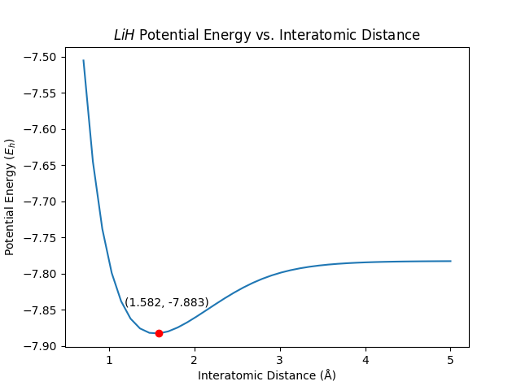

# Molecule Equilibrium State Finder
A project revolving around the Qiskit package which approximates molecular ground state energies using a Variational Quantum Algorithm. These ground state approximations are then plotted against different bond lengths and geometries to find equilibrium states for several molecules.

## What does this repository contain?
This repository has four important python scripts.

```
├── gs_energy_finder.py         <- Open-source license if one is chosen
├── tutorial_annotation.ipynb   <- Open-source license if one is chosen
├── figures                     <- Generated graphics and figures to be used in reporting
|  └── H<sub>2</sub>.py                    <- Finds equilibrium bond distance for an H<sub>2</sub> molecule
|  └── LiH.py                   <- Finds equilibrium bond distance for an LiH molecule
|  └── H<sub>2</sub>O.py                   <- Finds equilibrium geometry for an H<sub>2</sub>O molecule
```

### gs_energy_finder.py
This file serves as a module for the files in the equilibrium solvers folder. It contains an `Atom` class, which simplifies the setup for the SCF driver which simulates interactions between atoms in a molecule. The file also contains the `estimate_ground_state_energy` function which approximates the ground state energy of a given molecule using the SCF driver alongside Qiskit's `GroundStateEigensolver`.

### tutorial_annotation.py
This file's code is taken verbatim from Qiskit's documentation. I annotated each part of the code, explaining the logic of the solution in my own words. Creating these notes allowed me to understand the underlying phenomena behind molecular bonding, and now serves as additional documentation for this algorithm.

### H<sub>2</sub>.py, H<sub>2</sub>O.py, LiH.py
These files all use the `gs_energy_finder.py` file to compute equilibrium bond distances in the case of H<sub>2</sub> and LiH, and bond geometry for H<sub>2</sub>O. See the findings section below for more information.

## How do I use this package?
This package was not meant to be extended or used. With that said, if you do wish to use this package for your own work, feel free to do so. Please be sure to include the LICENSE file, since this work derives from Qiskit's documentation, and their LICENSE file should be included in any extentions or forks of this repository.

This project uses the uv package manager from astral. I won't provide a link to prevent it from being outdated by the time you see this, but it should be trivial to find. To use the file, be sure you're in the root directory, and run `uv sync` to install all the packages in the `pyproject.toml` file. If you wish to use another package manager, you can manualle install the packages listed in that file. Be sure to use the python version listed in `.python-version`.

To run files in the `equilibrium_solvers` folder, run the following.

`uv run -m equilibrium_solvers.FILENAME.py`

## Findings
The motivation behind this project was to learn about molecular bonding and the Qiskit library. Here, I'll list the findings of my work and important graphs which illustrate said findings. Note that the approximations are relatively crude. With more time and computational power, I could have used a more accurate basis than sto3g, which lacks some granularity when describing electron distributions. Changing to another basis would likely bring these approximations closer to the reference values.

### H<sub>2</sub>
For H<sub>2</sub>, I used the SCF driver and Qiskit's VQE solver to find the ground-state energy at varying bond distances. I found that at H<sub>2</sub>'s bond distance and ground state energy at equilibrium are 0.735 Å and -1.137 E<sub>h</sub>, respectively. This accurately approximates the reference values of ~7.4 Å and −1.136 E<sub>h</sub> (https://chem.libretexts.org/Courses/University_of_California_Davis/UCD_Chem_002A/UCD_Chem_2A/Text/Unit_IV%3A_Electronic_Structure_and_Bonding/10%3A_Bonding_II%3A_Additional_Aspects/10.1%3A_Bonding_Theories, https://www.researchgate.net/publication/385781779_Optimization_of_ground-state_energy_for_various_molecules_using_the_Variational_Quantum_Eigensolver_on_IBM's_quantum_computer)


### LiH
For LiH, I used the SCF driver and Qiskit's VQE solver to find the ground-state energy at varying bond distances. I found that at LiH's bond distance and ground state energy at equilibrium are 1.582 Å and -7.883 E<sub>h</sub>, respectively. This is slightly less accurate than the H<sub>2</sub> approximations but is still representative of the reference values: ~1.64 Å and −7.431 E<sub>h</sub> (https://indico.in2p3.fr/event/2481/contributions/24469/attachments/19766/24292/ID_72_poster_A0.pdf)

